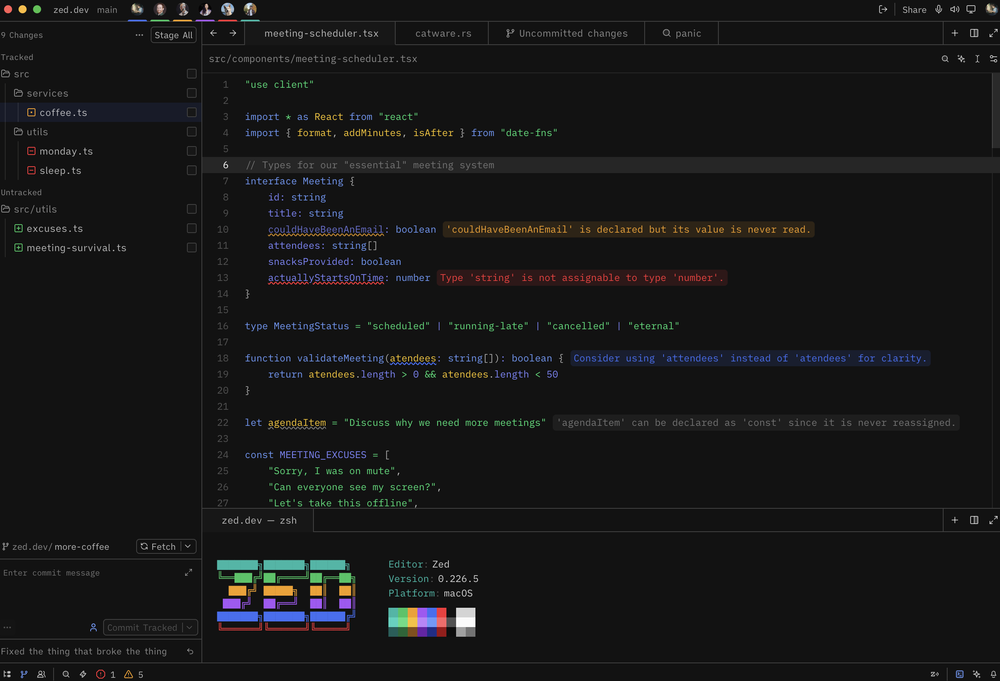
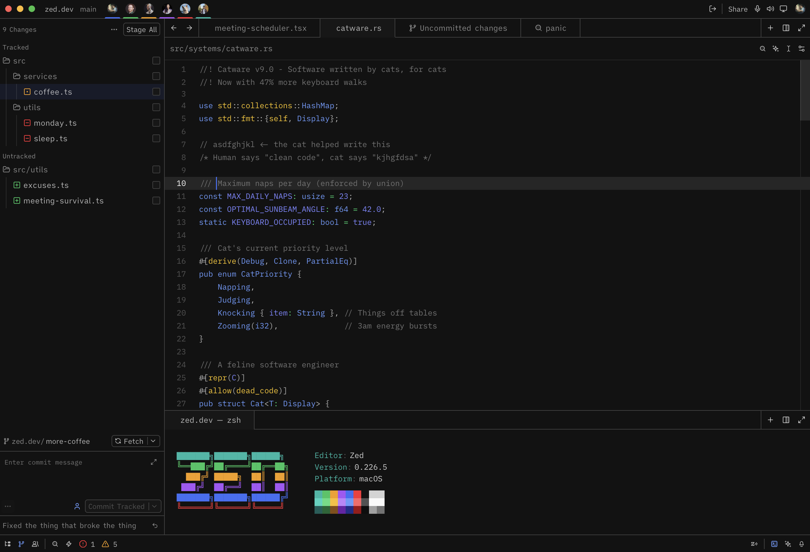
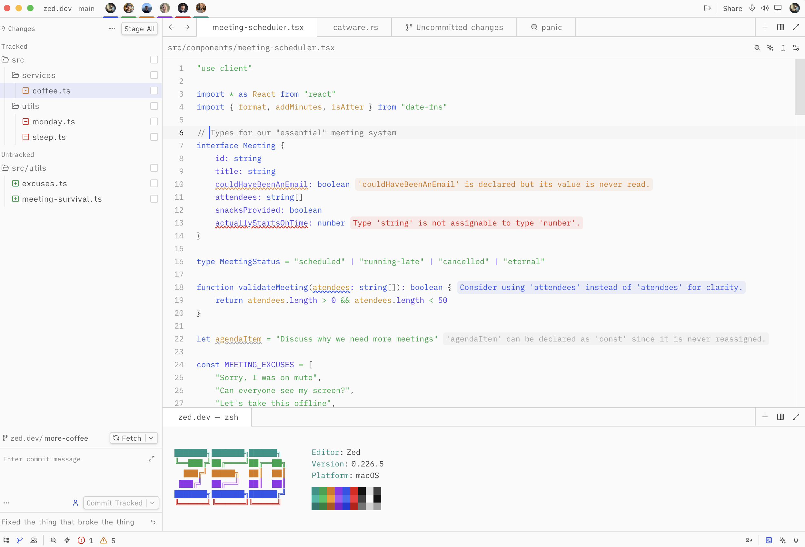
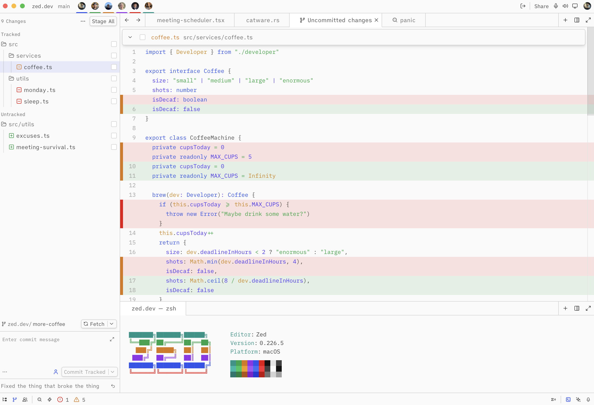
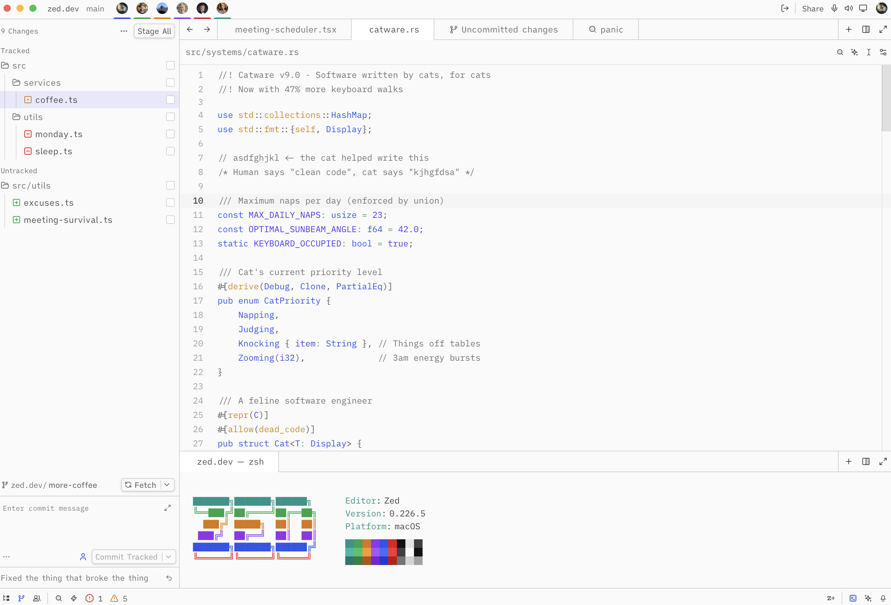

# Mantle Theme for Zed

A dark and light theme for [Zed](https://zed.dev) based on [ngrok's Mantle design system](https://mantle.ngrok.com). Features the full Mantle color palette with syntax highlighting matched to Mantle's Prism.js code block tokens.

## Screenshots

### Dark

### Light

## Installation

1. Open Zed
2. Go to **Extensions** (`cmd+shift+x`)
3. Search for "Mantle"
4. Click **Install**

## Variants

- **Mantle Dark** — deep neutral backgrounds with vibrant syntax colors
- **Mantle Light** — clean white surfaces with rich, readable tones

## Color Palette

| Role | Dark | Light |
|------|------|-------|
| Background | `#121212` | `#fafafa` |
| Surface | `#171717` | `#ffffff` |
| Accent | `#699afc` | `#2e54eb` |
| Strings | `#05df72` | `#00a63e` |
| Keywords | `#699afc` | `#2e54eb` |
| Constants | `#7c86ff` | `#4f39f6` |
| Variables | `#fdc700` | `#d08700` |
| Comments | `#737373` | `#737373` |

## License

[MIT](LICENSE)
